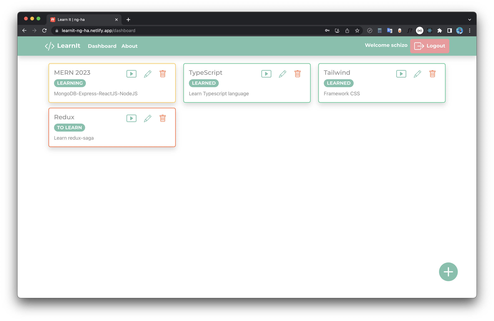

# A `MERN` app called LearnIt 🎯

### Link Demo 📌

[https://learnit-ng-ha.netlify.app/](https://learnit-ng-ha.netlify.app/)

### Features :computer:

A fullstack **MERN** (`mongoDB`, `expressjs`, `reactjs`, `nodejs`) app using `jsonwebtoken`-based authentication and basic CRUD operation with `RESTful API`

### Technologies ✨

- `ReactJs`
- Axios
- React-bootstrap
- React-router-dom
- MongoDB with `mongoose`
- `ExpressJs`
- `NodeJs`
- `Jsonwebtoken` + `argon2` hash algorithm
- `Docker`

### License :right_anger_bubble:

[MIT](https://choosealicense.com/licenses/mit/)
